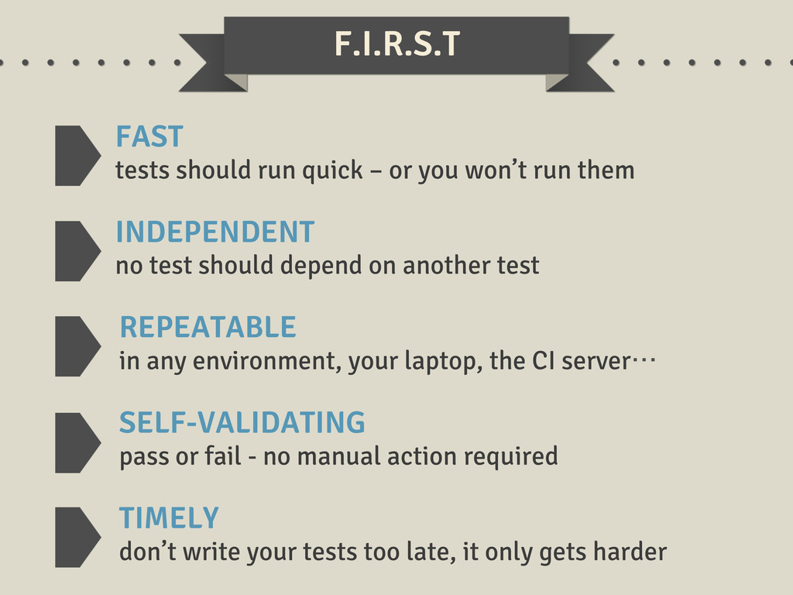

# Hands On Testes

Hands on para aprender sobre testes de Unidade


## Testando o DOMÍNIO


### Classe Conta

Vamos trabalhar a classe Conta com os seguintes métodos

* sacar
    * validarSeValorInformadoEhMenorOuIgualAZero (tanto para sacar como para depositar)
    * validarSeContaPossuiSaldoSuficiente
```java
if (this.saldo < valor) {
    throw new SaldoInsuficienteException("valor do saldo " + this.saldo);
}
```

* depositar

Vamos testar o tratamento de exceções
* métodos
    * nao_deve_aceitar_valores_negativos_para_deposito
    
* transferirPara

> Vale lembrar que a cobertura é importante para nos guiar

### Classe Cliente

*  nao_deve_criar_cliente_quando_cpf_for_invalido


> Discussão: devo testar a classe Cliente ou somente a classe ValidatorCPF?

### Classe Banco

* Adicionar Conta

* Deve oferecer titulos de capitalizacao por e-mail

Como vamos verificar que os e-mails foram enviados?

    * Mockito.verify(email, Mockito.times(3)).enviar(Mockito.any());
    * Mockito.verify(email, Mockito.times(1)).enviar(mensagem);
        * vai dar erro - ai precisamos implementar o equals
    * Usar polimofirmos para criar objetos

* Adicionar conta com verificação de CPF
    * com Receita Static - **mock static** 
    * com Receita Static - **Spy**
    * Injecao de dependencias via Constructors
        * Injecao de dependencia com Mocks
    * Injecao de dependencia via atributos
        * @InjectMocks
    * DSL para injetar Mocks
Ao adicionar conta precisamos verificar se o CPF está negativado. Para isso vamos usar a classe provida pela biblioteca da Receita federal **ReceitaFederalStatic**   

> Nomes dos testes podem ser melhorados com o @DisplayName


### Entendendo a diferença de Fake e Stub

* Sistema Bancario

Vamos fazer a classe SistemaBancario que registra um banco no BACEN. 

Ao registrar o Banco, o BACEN retorna o ID desse BANCO

## Testando a INFRA


### Serializador
Precisamos serializar nossos objetos. Várias formas (XML, JSON). E como testar todos?

```java
@ParametizedTypes
```

* Erro no Jackson por constructor sem argumentos


Na primeira situação vamos verificar que o Jackson precisa de um default Constructor
    * Solução colocar constructor PRIVATE no Cliente PF e default no Cliente

* Erro no Xstream por forbidden

Adicionar Xstream
```java
xstream.addPermission(AnyTypePermission.ANY);
```

### ValidatorCPF com Null e Empty

Fazer testes no Validator de CPF

```java
@ParameterizedTest
@NullAndEmptySource
```

Fazer testes com parâmetros válidos

```java
@ParameterizedTest
@ValueSource(strings = {"426.867.900-67", "42686790067"})
```


## Projetos Extras

### JunitExtensions

O projeto Junit Pionner reune extensions

https://github.com/junit-pioneer/junit-pioneer

Como testar variáveis de ambiente?

```xml
<dependency>
    <groupId>org.junit-pioneer</groupId>
    <artifactId>junit-pioneer</artifactId>
    <version>1.4.2</version>
    <scope>test</scope>
</dependency>
```

Adicionando annotations

```java
 @SetEnvironmentVariable.SetEnvironmentVariables(
            value = {@SetEnvironmentVariable(key = "VARIAVEL", value = "VALOR"), 
                    @SetEnvironmentVariable(key = "VARIAVEL2", value = "VALOR2")});
```


### System.out

Cada vez mais necessário para serviços servless

https://stefanbirkner.github.io/system-rules/


```xml
<dependency>
    <groupId>com.github.stefanbirkner</groupId>
    <artifactId>system-rules</artifactId>
    <version>1.19.0</version>
    <scope>test</scope>
</dependency>
```

```java
@Rule
public final SystemOutRule systemOutRule = new SystemOutRule().enableLog();

@Test
public void writesTextToSystemOut() {
    System.out.print("hello world");
    assertEquals("hello world", systemOutRule.getLog());
}
```


### Ordem de métodos

CUIDADO! Devemos seguir a regra F.A.S.T do **cleancode**




Mas se vc precisar...

```java
@TestMethodOrder(OrderAnnotation.class)

@Test
@Order(1)
```

### Dependendo do S.O


```java
@EnabledOnOs(MAC)
void onlyOnMacOs() {
}

@DisabledOnOs(WINDOWS)
void notOnWindows() {
}

@EnabledIfSystemProperty(named = "os.arch", matches = ".*64.*")
void onlyOn64BitArchitectures() {
}

@Test
@EnabledIfEnvironmentVariable(named = "ENV", matches = "staging-server")
void onlyOnStagingServer() {
}

```

# Testes de Integração

## Sistema de Arquivos - BIGBALL of mud


Vamos precisar criar um serviço para salvar uma conta no diretorio

A lógica já está criada e é bizarra

https://www.invertexto.com/


```java
if (id == null) {
    throw new IllegalStateException("caminho para arquivo não pode ser montado pois ele é nulo");
}
String diretorio = null;
if (id <= QUANTIDADE_MAXIMA_ARQUIVOS_NO_DIRETORIO) {
    diretorio = BASE + "/1";
} else {
    int i = 2;
    boolean achouDiretorio = false;
    while (!achouDiretorio) {

        if (id <= (i * QUANTIDADE_MAXIMA_ARQUIVOS_NO_DIRETORIO)) {
            diretorio = BASE + "/"+i;
            achouDiretorio = true;
        }
        i++;
    }
}
```


Que lógica é essa? Loucura não?
```
ID 1 a 5 - diretório: 1
ID 6 a 10 - diretório: 2
ID 11 a 15 - diretório: 3
...
```
Queremos algo como

```
arquivos/contas/1/conta1
arquivos/contas/1/conta2
arquivos/contas/1/conta3
arquivos/contas/2/conta7
```


* E Se vc precisa repetir um teste mais de uma vez? Cada execução prevendo o mesmo resultado?

```
@RepeatedTest(3)
```


* Mas isso não seria teste de integração? E se vc pega um filesystem que vc não pode escrever? Lembre-se que os testes precisam ser independentes do ambiente

```
@TempDir
```

Precisaríamos portanto refatorar o código para receber por injeção um diretório destino


## Caso Feliz do Banco

Testando o ContaDAO em H2

* Tradeoffs: rápido, porém JPQL complica

## Caso Médio e Feio

Aqui não tem jeito, teria que usar o MockStatic
 

## Teste em Containers  

Vamos agora para o projeto do Quarkus fazer testes em Containers


* Falar um pouco sobre ActiveRecord


> Testes em containers no CI -
>
> https://docs.gitlab.com/ee/ci/services/postgres.html
>
> https://gitlab.com/gitlab-examples/postgres/-/blob/master/.gitlab-ci.yml

## Testes em API's

* HelloResourceTest
* AlunoResourceTest

## Testes com Selenium

* Sem PageObject
* COM PageObject Playground

Sites para playground

* http://www.uitestingplayground.com/sampleapp
* techbeamers.com/websites-to-practice-selenium-webdriver-online/
* https://phptravels.com/demo/

> puppetter
>